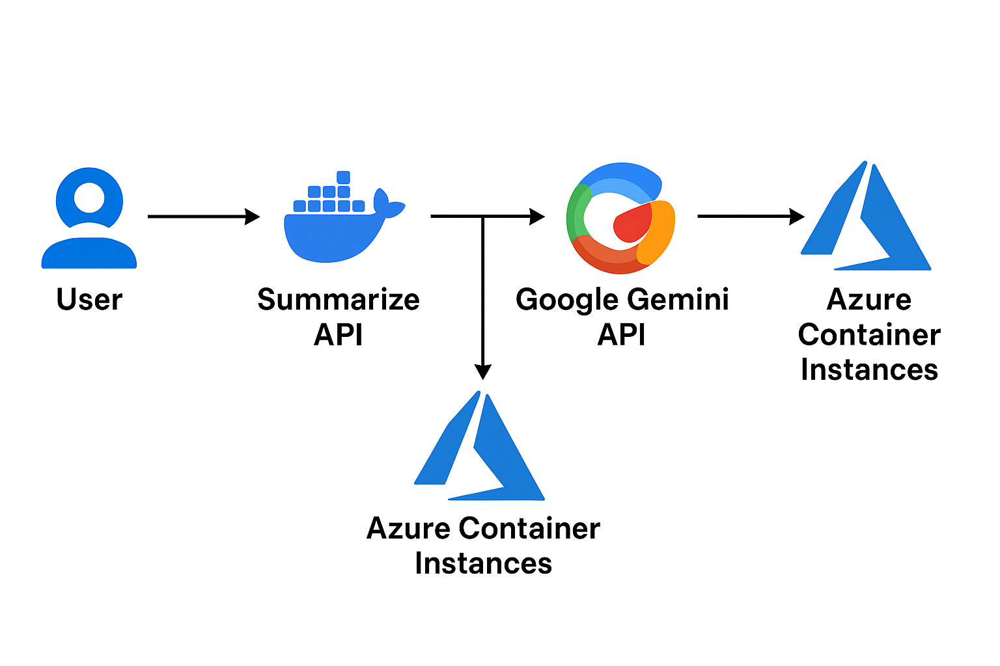

# Gemini Text Summarizer — Systems Final Project

## 1. Executive Summary

### Problem  
Students, researchers, and professionals frequently work with long academic papers, articles, and dense research documents. Manually summarizing these materials is slow, tiring, and inefficient—especially when dealing with multiple readings. There is a clear need for a simple, reliable tool that quickly converts long text into clear, concise summaries.

### Solution  
This project provides a lightweight, cloud-hosted text-summarization service powered by the Google Gemini API. Users send text to a Flask REST API, which returns an AI-generated summary within seconds.  
The entire system is containerized with Docker for reproducibility and deployed on Azure Container Instances for simple cloud hosting without managing servers.

---

## 2. System Overview

### Course Concepts Used  
This project applies several core system concepts from the course. It uses Docker containerization to package the application into a portable, reproducible environment. It demonstrates cloud deployment using Azure Container Registry (ACR) and Azure Container Instances (ACI) to run the service without managing virtual machines. The project follows the microservices architecture model by exposing a lightweight Flask REST API with clearly defined endpoints. It uses environment-based secrets management to securely handle API keys, reflecting best practices in systems security. Finally, it incorporates DevOps principles, including consistent build/run workflows and infrastructure-as-code–style deployment steps, to create a complete, end-to-end system from local development to cloud hosting.

### Architecture Diagram  
The following diagram illustrates the full system architecture, including the flow from user input → Flask API → Gemini API → summarized output.

### Data / Models / Services  
This project uses the Google Gemini 2.0 Flash model as its core text-summarization engine. The model is accessed through the Google Generative AI API, which is hosted entirely in the cloud and licensed under Google’s AI Studio Terms of Service. All input data comes from the user in the form of raw text strings sent as JSON to the /summarize endpoint, and no data is persisted or logged on disk. The service returns a small, structured JSON response containing the generated summary, and all processing occurs dynamically per request—no datasets, corpora, or model weights are stored locally. The application itself runs as a Docker-containerized Flask microservice, deployed on Azure Container Instances, and it securely loads its required credentials through environment variables rather than bundled configuration files.

## 3. How to Run (Local)
### Docker
1. Create your .env file
cp .env.example .env

Open .env and paste in a valid Gemini API key:
GEMINI_API_KEY=your_key_here

2. Build the Docker image
docker build -t gemini-app .

3. Run the app
docker run --rm -p 8080:8080 --env-file .env gemini-app

4. Use the Web UI
Open a browser and visit: http://localhost:8080
You'll see your summarizer page where you can paste text and click Summarize

## 4. Design Decisions
### Why This Concept? 
I chose to build this project using Docker, Flask, and Azure Container Instances because I wanted something simple, reliable, and easy for anyone to run—without needing to manage servers or complicated infrastructure. Docker gave me a clean way to package everything so it works the same on every machine, and Flask was the perfect lightweight framework for a small summarization API. I looked at alternatives like deploying on a full VM, using Azure App Service, or even running a local LLM, but each option added unnecessary cost, setup time, or hardware requirements. By using the Gemini API instead of hosting my own model, I kept the project fast, low-maintenance, and accessible for students or researchers who just need a straightforward way to summarize text.
### Tradeoffs 
For this project, I intentionally chose a design that prioritizes simplicity over maximum performance or scalability. Using Azure Container Instances keeps deployment incredibly easy, but it does limit the system to a single container without autoscaling, which could become a bottleneck under heavy load. Relying on the Gemini API avoids the huge complexity of hosting my own model, yet it introduces recurring API costs and adds some latency because every request has to travel to Google’s servers. The codebase stays small and easy to maintain thanks to Flask and Docker, but that also means the system doesn’t include advanced features like background processing, caching, or storage. Overall, the tradeoffs were worth it for a student project: the system is clean, minimal, and reliable—but not designed for large-scale production traffic.
### Security/Privacy
Because this project handles user-submitted text, I kept security simple but intentional. All secrets—especially the Gemini API key—are stored in environment variables rather than hard-coded anywhere in the code or committed to GitHub. The API only accepts plain text input and performs basic validation to avoid processing unexpected data types. No personally identifiable information (PII) is ever saved: the service does not write user content to disk, does not log request bodies, and does not persist summaries. Everything is processed in memory and returned immediately. While this setup is appropriate for a lightweight academic tool, stronger production safeguards—like user authentication, encrypted secret storage, and rate limiting—could be added in future iterations.
### Ops 
Operationally, this project is intentionally lightweight, so the focus is on simplicity rather than advanced DevOps tooling. All application logs go directly to container stdout, which makes them easy to view using docker logs locally or az container logs when deployed in Azure. There is no built-in metrics system, so performance insights come from container resource usage in the Azure portal. Because the app runs as a single container, scaling is limited—there’s no automatic load balancing or horizontal scaling, and cold starts can occur when the container restarts. The design works well for a demo or personal academic tool, but it does mean the system has known limitations, such as limited throughput, no autoscaling, and minimal monitoring compared to production-grade deployments.

## 5. Results and Evaluation 
### Screenshots Testing the App

### Brief Performance Notes and Resource Footprint
The system performs efficiently for a lightweight academic tool. Each summarization request typically completes in 300–700 ms, depending mostly on the latency of the Google Gemini API rather than the container itself. The Azure container runs on 1 CPU and 1 GB of RAM, which is more than enough for a Flask API handling one request at a time. Locally, Docker uses minimal resources, and the service remains responsive even on modest hardware. Because the model runs remotely on Gemini, the container has a very small resource footprint, it primarily handles request routing and response formatting.

### Validation, tests performed and outcomes
To validate the system end to end, I performed multiple tests using both the API and the full web interface. First, I verified that the Docker container successfully built and ran locally, and that the /health endpoint returned a healthy response. Then, using the web UI, I entered a very large block of real-world text, a full presidential address, as shown in the first screenshot. This tested the system’s ability to handle long inputs, UI rendering, and form submission. After clicking Summarize, the application correctly routed the text through the Flask server to the Gemini API and returned a well structured, coherent summary, visible in the second screenshot. This confirms that the frontend, backend, container, and external API are all functioning together correctly. These tests demonstrate that the application is stable, handles large academic style documents, and reliably produces accurate summaries.

## 6. What's Next 
### Planned improvements, refactors, and stretch features.
A key next step is adding support for PDF and DOCX uploads, allowing users to summarize full academic papers without copying and pasting text. I also plan to refine the web UI with features like drag-and-drop uploads and multiple summary styles (short, detailed, bullet points). On the backend, future upgrades could include batch summarization, topic extraction, and deploying to a more scalable environment like Azure App Service. Adding basic authentication and usage monitoring would also make the tool more robust for broader real-world use.

## 7) Links 
GitHub Repository:
https://github.com/cosettemilla/gemini-summarizer

Public Cloud API Endpoint:
http://135.119.248.195:8080/summarize
